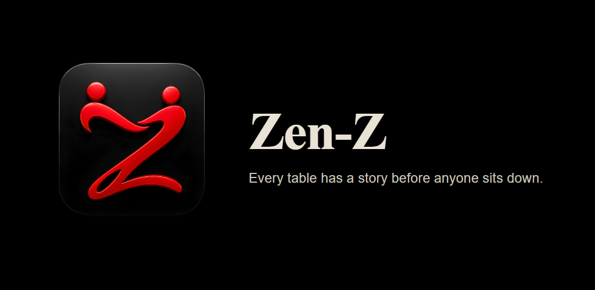
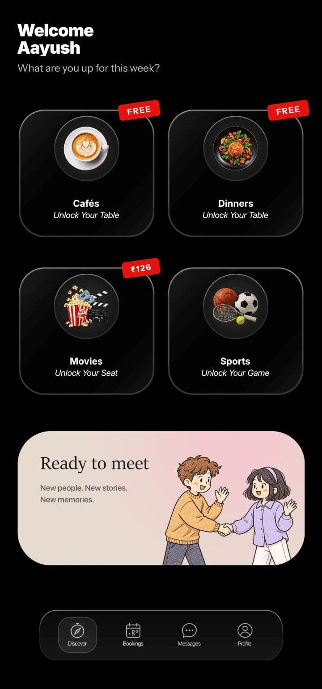
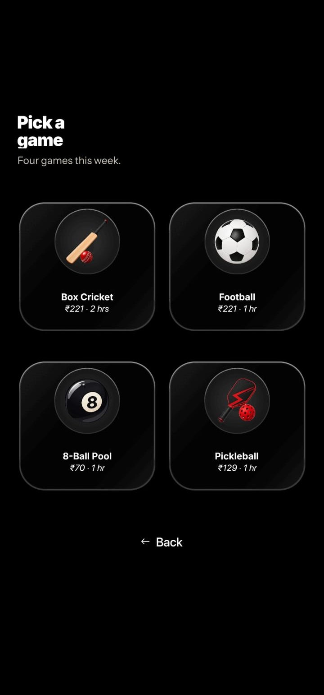
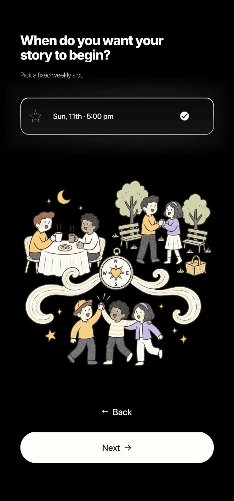
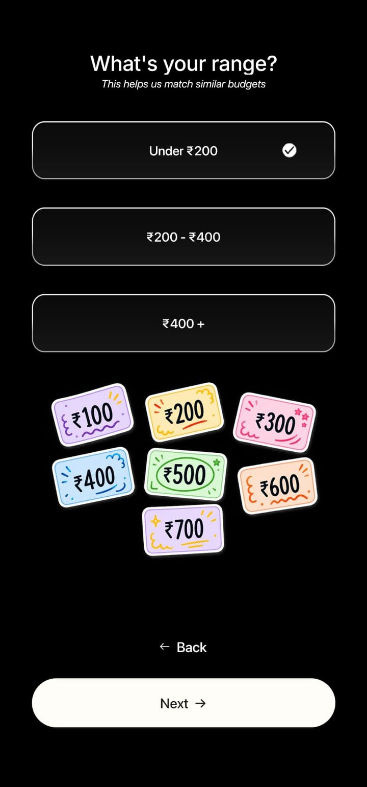
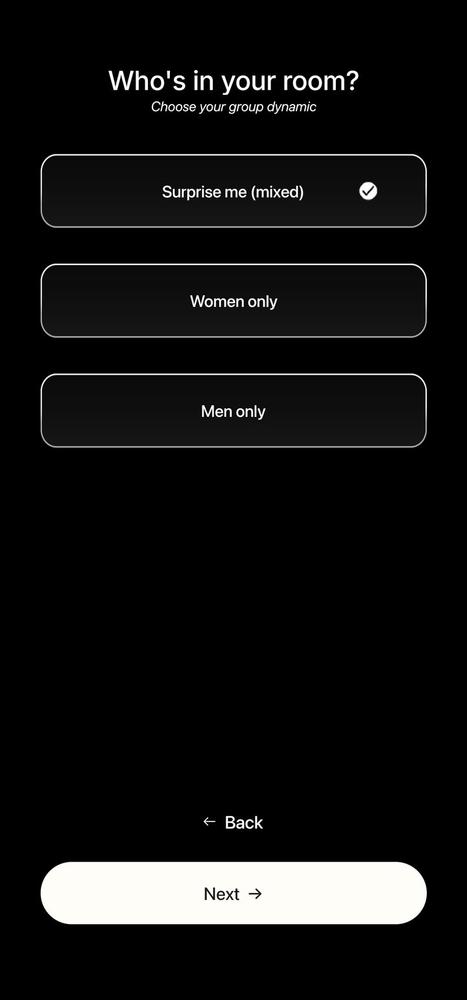
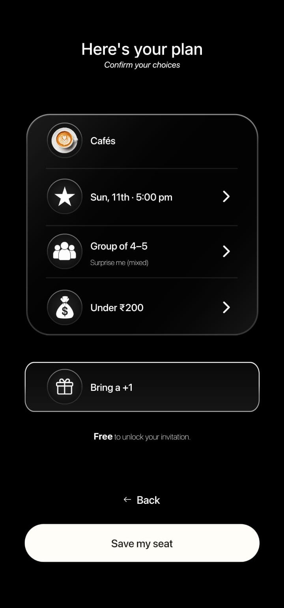
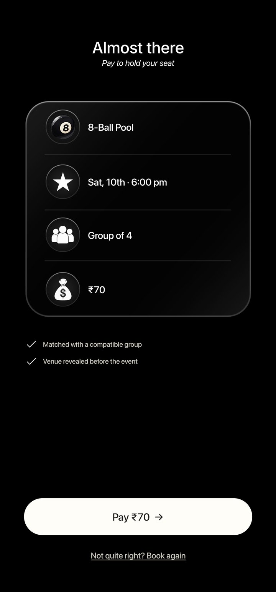

<p align="center">
  
</p>

# Zen-Z

**A campus app that puts you at a table with four strangers who like the same things you do. Pick a café, dinner, movie or sports slot, take a short personality quiz, and a real person matches your group.**

Most students have friends. What they often don't have is someone who wants
to watch the same movie, play the same sport, or talk about the same things.
Zen-Z fixes that one evening at a time: you book a slot, we build you a good
table, and you show up.

I built Zen-Z by myself, starting in July 2026: the Android app, the
dashboard our team used to match students, the website, and the backend. It
launched on Google Play for students at Jaipur National University on
24 September 2026. In its first week, 150+ students finished the
personality quiz, and our Instagram reached 140K+ views.

Built by **Aayush Thakur**.

## Screenshots

<table>
  <tr>
    <td align="center"><br><sub><b>Home</b>: pick what you're up for</sub></td>
    <td align="center"><br><sub><b>Sports</b>: four games, priced per slot</sub></td>
    <td align="center"><br><sub><b>Time</b>: a fixed weekly slot</sub></td>
    <td align="center"><br><sub><b>Budget</b>: matched with similar budgets</sub></td>
  </tr>
  <tr>
    <td align="center"><br><sub><b>Group</b>: mixed, women only or men only</sub></td>
    <td align="center"><br><sub><b>Your plan</b>: check it, bring a +1</sub></td>
    <td align="center"><br><sub><b>Payment</b>: paid slots go through PayU</sub></td>
    <td></td>
  </tr>
</table>

## How it works

1. **Sign in with your email.** You get a one-time code. No password to remember.
2. **Make a profile and take the quiz.** A few questions about how you like
   to spend an evening, how social you feel, and what you're into.
3. **Book a slot.** Café, Dinner, Movie, or a sport (box cricket, football,
   8-ball pool or pickleball). Cafés and dinners are free to book. Choose a
   time, your budget, and a mixed, women-only or men-only group. You can
   bring a friend if you don't want to arrive alone.
4. **Get matched.** Our team looks at everyone booked for that slot and puts
   together groups of 4 or 5 people who should get along, then picks the venue.
5. **Meet your group.** You see your groupmates' first names and interests,
   chat with them in the app, and get a reminder before it starts.

## What I built

**The student app** (Android). Everything above: sign-in, profile, quiz,
booking, payments, group chat, notifications, referrals, reporting someone,
and deleting your account.

**The matching dashboard** (web). Where the team does the actual matching.
Students show up as cards that you drag between groups. It also handles
venues, movie listings, bookings, payments that need a second look, safety
reports, and basic analytics.

**The website** (web). The public home page, pricing, FAQ, and the legal
pages Google Play and our payment provider require.

**The backend.** The database, the security rules that decide who can see
what, payments, the quiz scoring, and push notifications.

## Problems I'm glad I solved

**Nobody sees anyone else's photo.** Students upload a photo so the team can
recognise them, but other students should never see it, not even their own
groupmates. I didn't want that to depend on the app simply not showing it,
so the database itself refuses to hand photos to anyone except the team.
There's an automated test that checks this.

**Payments can't be faked.** The app never tells the server what to charge.
The server works out the price itself, and a booking only counts as paid
once the payment provider confirms it directly, with a signature the server
checks. When a payment gets stuck halfway, it shows up on the dashboard so
the team can sort it out.

**The quiz can change without an app update.** Every question, answer and
scoring rule lives in the database. Adding a new question is one database
entry, not a new release on the Play Store.

**Updates without the Play Store.** Fixes and copy changes reach phones
over the air, so a typo fix doesn't need a new store review.

**Group chat stays private.** The dashboard can show who reported whom and
why, but it never shows the chat messages themselves. That was a deliberate
choice, and it's written down in the docs along with the reasoning.

**Every change gets checked.** Each push to GitHub runs linting, type
checks, unit tests for all three apps, a full production build of the
dashboard, and a set of database tests that try to break the security rules.

## Tech stack

| Part | Built with |
| --- | --- |
| Student app | React Native, Expo, TypeScript, Expo Router, NativeWind, Zustand, TanStack Query |
| Matching dashboard | Next.js, TypeScript, Tailwind, shadcn/ui, dnd-kit (drag and drop) |
| Website | Next.js, Tailwind |
| Backend | Supabase: Postgres, Auth, Storage, Realtime chat, Edge Functions (Deno) |
| Payments | PayU, with server-side order creation and verified webhooks |
| Testing | Vitest, Jest, pgTAP (database tests), GitHub Actions |
| Releases | EAS Build and EAS Update |

## Decisions and trade-offs

| Decision | Why | Trade-off |
| --- | --- | --- |
| **People match the groups, not an algorithm** | With a few hundred students, a person who reads the quiz results makes better tables than code would, and learns what a good match looks like along the way. | It doesn't scale past one campus. The quiz scores are already stored in a form an algorithm could use later. |
| **Email codes only, no phone sign-in** | Free to send and quick to set up. SMS in India needs weeks of registration. | Codes can land in spam, so I wrote a small tool to unblock testers during the first days. |
| **No venue picker when booking** | The team picks the venue after matching, based on who is in the group and their budget. | Students book without knowing exactly where they'll go. |
| **Security rules in the database, not just the app** | If the app has a bug, the data is still protected. Photos, chats and payments are all guarded this way. | Every new feature needs its rules written and tested, which takes longer. |
| **Two environments, every change saved as a file** | A dev and a prod database, and every schema change is a file in this repo, so nothing gets changed by hand in production. | No staging environment yet, so the dev database has to stand in for one. |

## Running it locally

You need Node 22 and a Supabase project.

```bash
npm install

cp apps/mobile/.env.example apps/mobile/.env
cp apps/admin/.env.local.example apps/admin/.env.local
# fill in your Supabase URL and anon key in both

npx supabase link --project-ref <your-project-ref>
npx supabase db push

npm run mobile   # student app (Expo)
npm run admin    # matching dashboard on localhost:3000
```

Tests: `npm run test:functions` for the backend logic, `npm run test:db` for
the database security tests.

Payments need PayU credentials set as Supabase secrets:
`PAYU_MERCHANT_KEY`, `PAYU_MERCHANT_SALT`, `PAYU_MERCHANT_ID`,
`PAYU_CLIENT_ID`, `PAYU_CLIENT_SECRET`, `PAYU_API_BASE_URL`,
`PAYU_OAUTH_TOKEN_URL`.

## More detail

- [Product spec](docs/PRODUCT_SPEC.md): every screen and rule
- [Architecture](docs/ARCHITECTURE.md): the technical decisions and why
- [Milestones](docs/MILESTONES.md): how the build was planned, step by step

## Author

**Aayush Thakur**, B.Tech CSE at Jaipur National University.
[LinkedIn](https://www.linkedin.com/in/aayush-thakur-5b0734326)
